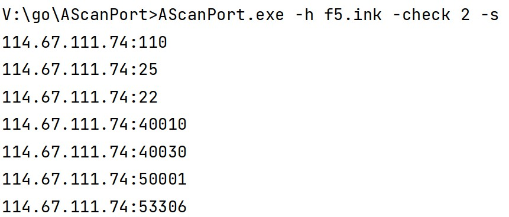
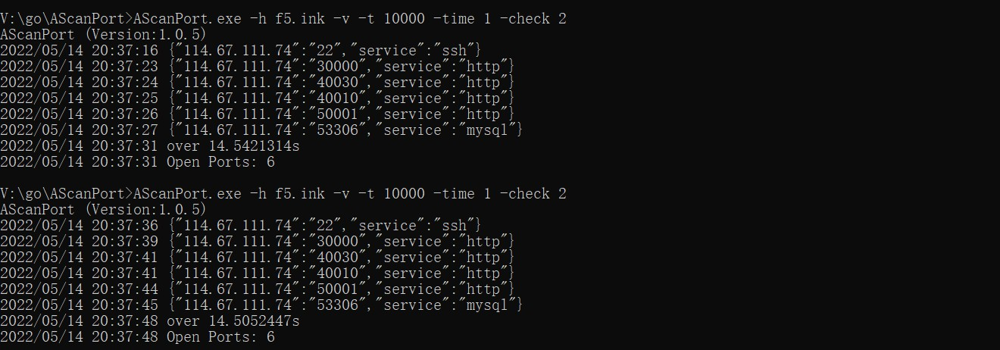
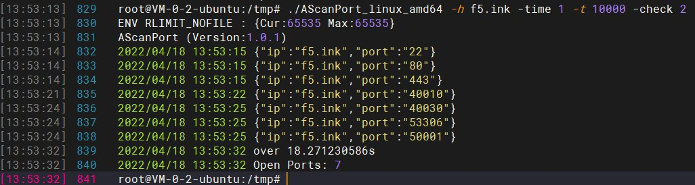
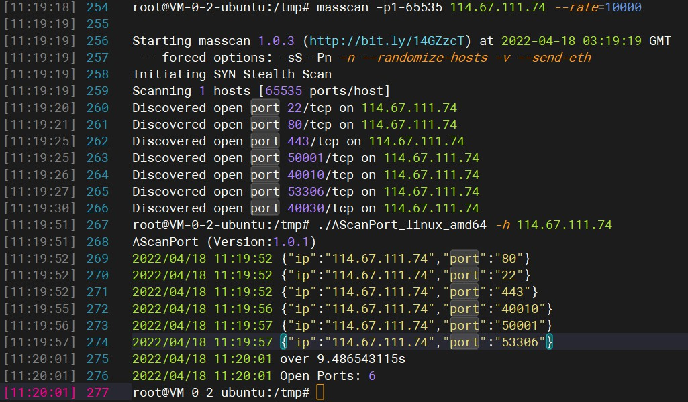

# AScanPort
AScanPort 高速、多线程、全端口、单IP扫描、多IP扫描、多网段扫描。

## 食用方法

```
Usage of AScanPort:
  -check int
    	MaxCheck:Connect check the maximum number (default 1)
  -format string
    	Result format: text=>ip:port,json=>{"ip":"port"} (default "text")
  -h string
    	Target:f5.ink|114.67.111.74|114.67.111.74/28|114.67.111.74-80|114.67.111.74-114.67.111.80|114.67.111.* (default "f5.ink")
  -hf string
    	Target:ip.txt
  -out string
    	result.txt
  -s	silent mode
  -t int
    	Maximum threads (default 1000)
  -time int
    	timeout:3 seconds (default 2)
```

### 支持导出格式:
- text: f5.ink:80
- json: {"f5.ink":"80"}
### 静默模式 [-s]
```
./AScanPort_linux_amd64 -h f5.ink -check 2 -s
```


### 服务识别 [-v]
```
./AScanPort_linux_amd64 -v -h f5.ink -t 10000 -time 1 -check 2
```


### 扫描结果
```
./AScanPort_linux_amd64 -h f5.ink -time 1 -t 10000 -check 2
```


## AScanPort VS masscan

VPS:腾讯云、200Mbps、上海



## 项目背景与更新主线

AScanPort是对标masscan的速度，暂未增加SYN模式

- 2022年5月16日 16:29:16 | Version1.0.5 |新增简易服务识别功能、修复若干bug。 
- 2022年5月13日 17:52:41 | 新增实时保存扫描结果、新增静默模式只输出"ip:port"、支持ip.txt文件读取目标(目标识别和-h参数一致)、修复若干bug、支持多网段扫描。
- 2022年4月24日 09:59:43 | 最终还是继续更新，修复默认不保存扫描结果，添加目标支持网段识别、自动计算子网等5种类型。(扫段平均一个ip需16秒，如果觉得慢建议设置timeout为1、线程高一些)
- 2022年4月20日 10:42:51 | 关于增加fuzz、poc、爆破、获取特征的需求，AScanPort不再更新。后期另外成立一个项目，欢迎各路大佬多多指教。

